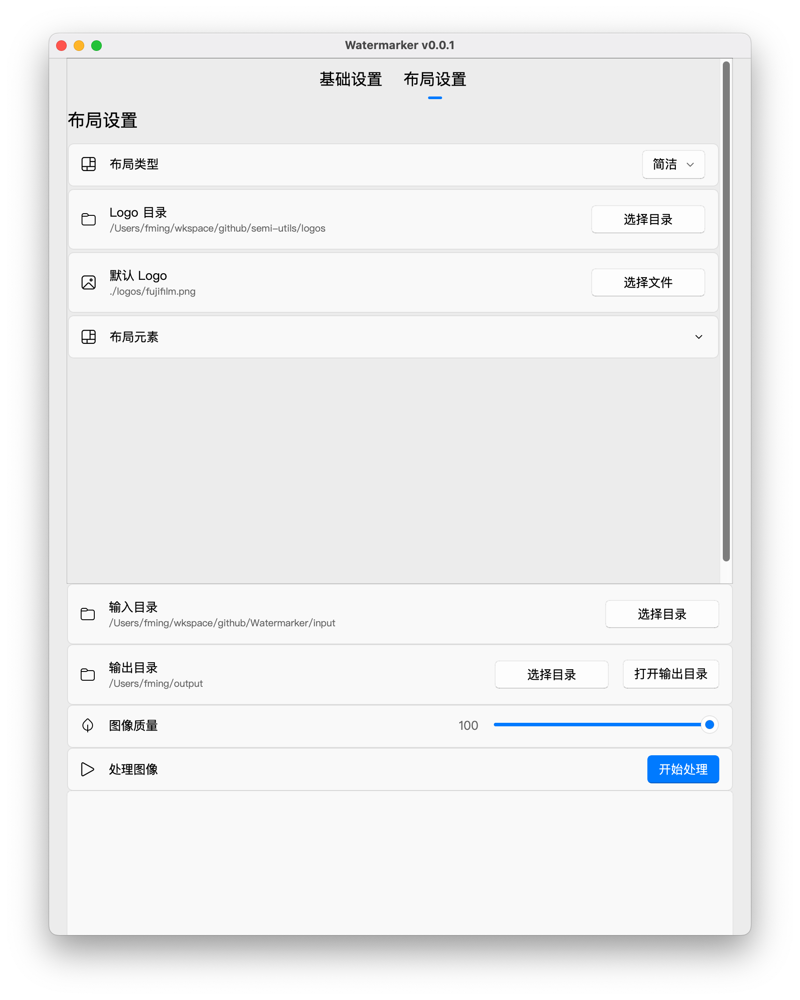

# Watermarker(水印仔)

> [](https://github.com/frostming/Watermarker/releases)
> [](https://github.com/frostming/Watermarker/releases)
> [](https://github.com/frostming/Watermarker/blob/master/LICENSE)
> 
>
> **这是一个用于给照片批量添加水印、处理照片像素比、图像色彩和质量的工具。**



## 效果展示

| 布局                  | 样例               |
| --------------------- | ------------------ |
| 标准                  |  |
| 标准(Logo 居右)       |  |
| 标准(黑红)            |  |
| 标准(黑红, Logo 居右) |  |
| 自定义                |  |
| 1:1                   |  |
| 简洁                  |  |
| 背景模糊              |  |
| 背景模糊+白框         |  |


## 安装与下载

到[发布页](https://github.com/frostming/Watermarker/releases)下载对应系统的安装包，解压后即可使用。目前只支持 macOS 和 Windows。Linux 用户可以查阅下面的开发文档自行编译。

> [!TIP]
> MacOS 安装包打开提示软件未签名解决方法，前往系统偏好设置 -> 安全性与隐私 -> 通用 -> 允许从任何来源下载的应用程序，然后再次打开安装包即可。

## 开发

本项目使用 [uv](https://github.com/astral-sh/uv) 管理，请先安装 `uv`：

```bash
curl -fsSL https://uv.astral.sh/install.sh | bash
```

然后执行以下命令：

```bash
uv sync --group gui
```

启动 GUI 界面：

```bash
uv run main.py
```

图形界面使用 [PySide6](https://doc.qt.io/qtforpython/) 开发。

打包程序：

```bash
uv run pyinstaller Watermarker.spec
```

## 鸣谢

* Watermarker 基于 @leslievan 的 [Semi-Utils](https://github.com/leslievan/semi-utils)开发，该项目经 Apache License 2.0 授权许可。
* Watermarker 引用了 [exiftool](https://exiftool.org/)，其发布基于 [GPL v1 + Artistic License 2.0](https://exiftool.org/#license)。
* Watermarker 使用了 [PyQt-Fluent-Widgets](https://github.com/zhiyiYo/PyQt-Fluent-Widgets/)开发 GUI 界面。
